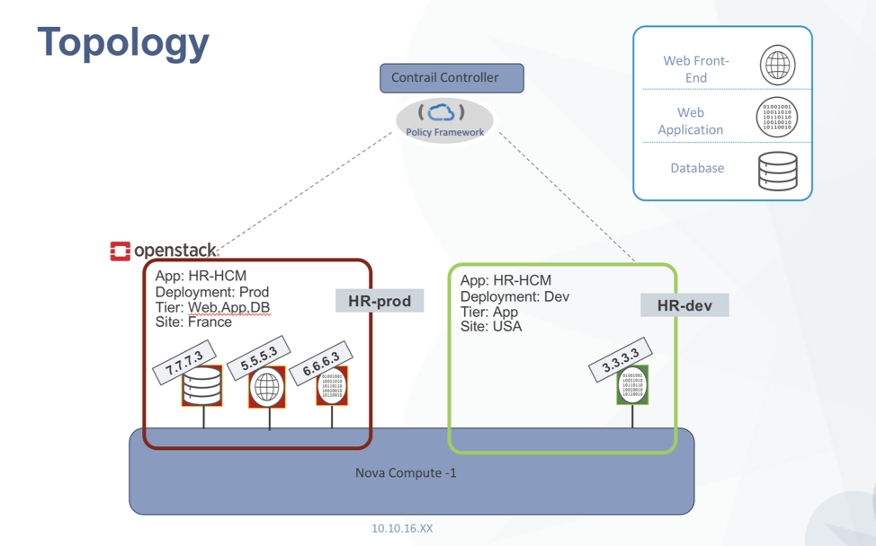

# Contrail Security Example for all in one setup

This script creates security policies for a demo topology. <br />
Note: This procedure follows a specific demo topology and it's encouraged to use same or similar topology to effectively show case Contrail Security.[More info](https://github.com/fashaikh7/Contrail-Security/wiki/Contrail-Security-with-OpenStack-and-Bare-Metal-Server)

## Getting Started

These instructions will get you a copy of the project up and running on your local machine for development and testing purposes. This playbook performs the following tasks to demonstrate the functions to contrail security. <br />
1) Creates two projects and brings up three VMs (web,app,db) with respective containers on both the projects. <br />
2) It then applies the security polies on the fabric.

### Prerequisites

1)It is assumed that an all in one setup is pre-installed.
Refer the following page to install an all_in_one setup [ansible_deployer](https://github.com/Juniper/contrail-ansible-deployer/wiki/Contrail-with-Kolla-Ocata)
<br />
2)Here is an example of [instance.yaml](./allinone_instance.yaml)<br />

### Topology

### Installing

Clone the repo and edit these configuration files.

```

yum -y install git ansible-2.4.2.0
yum install -y gcc python-devel
pip install python-openstackclient
pip install python-ironicclient
cd /root/
git clone https://github.com/arohigupta/playbook_security.git
cd playbook_security/ansible_openstack/all_in_one/
vi group_vars/all
```

In the file `group_vars/all`.

```
httpd_port: 8082
controlserver: <IP_address_BMS>
```

Also change the following file with the same value:
```
vi roles/create_openstack_vms/defaults/main.yaml
```
```
hosts:
  - ip: <ip_address_BMS>
```
## Running the Playbook
To run the playbook run the following command. Ensure you are in the `all_in_one` directory

```
source /etc/kolla/kolla-toolbox/admin-openrc.sh
ansible-playbook playbook.yaml
```


## Testing the outcome.

Explain what these tests test and why

```
Give an example
```
