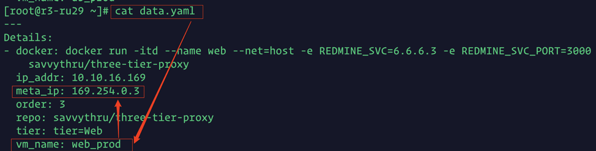

# Contrail Security Example for all in one setup

This script creates security policies for a demo topology. <br />
Note: This procedure follows a specific demo topology and it's encouraged to use same or similar topology to effectively show case Contrail Security.[More info](https://github.com/fashaikh7/Contrail-Security/wiki/Contrail-Security-with-OpenStack-and-Bare-Metal-Server)

## Getting Started

These instructions will get you a copy of the project up and running on your local machine for development and testing purposes. This playbook performs the following tasks to demonstrate the functions to contrail security. <br />
1) Creates two projects and brings up three VMs (web,app,db) with respective containers on both the project HR_prod and a app vm on HR_dev. <br />
2) It then applies the security polies on the fabric.

### Prerequisites

1)It is assumed that an all in one setup is pre-installed.
Refer the following page to install an all_in_one setup [ansible_deployer](https://github.com/Juniper/contrail-ansible-deployer/wiki/Contrail-with-Kolla-Ocata)
<br />
2)Here is an example of [instance.yaml](./allinone_instance.yaml)<br />

### Topology

### Installing

Clone the repo and edit these configuration files.

```

yum -y install git ansible-2.4.2.0
yum install -y gcc python-devel
pip install python-openstackclient
pip install python-ironicclient
cd /root/
git clone https://github.com/arohigupta/playbook_security.git
cd playbook_security/ansible_openstack/all_in_one/
vi group_vars/all
```

In the file `group_vars/all`.

```
httpd_port: 8082
controlserver: <IP_address_BMS>
```

Also change the following file with the same value:
```
vi roles/create_openstack_vms/defaults/main.yaml
```
```
hosts:
  - ip: <ip_address_BMS>
```
## Running the Playbook
To run the playbook run the following command. Ensure you are in the `all_in_one` directory

```
source /etc/kolla/kolla-toolbox/admin-openrc.sh
ansible-playbook playbook.yaml
```


## Testing the outcome.

The web_prod (5.5.5.3) vm should be able to get data from the db_prod (7.7.7.3) ( vm through the app_prod vm(6.6.6.3) . Also the web_prod vm(5.5.5.3) should not be able to communicate with the app_dev vm(3.3.3.3). <br />

Step1 : Navigate to OpenStack dashboard and select the HR-prod project. <br />

```
http://<IP_address>
```


Step 2: Navigate to contrail UI. <br />
```
https://<IP_address>:8143
```
To take a look at the visualization, select monitor -> security -> traffic groups -> all project<br />

<br />

<br />
Under “time range” select the value “since” and for “from time” type in “now”. <br />

Step 3: Login into the web_prod VM using the following steps.<br /> 
a.Login to your BMS<br />
b. ```cat /root/data.yaml```<br />
c. Look for the `meta_ip` of the `web_prod` vm. <br />

d. SSH using the meta_ip to get into the `web_prod` vm. <br />
For example: `ssh root@169.254.0.3 `<br />
Login: root/c0ntrail123<br />

<br />
Step 4: <br />
Check if the web container is running. <br />
```
docker ps
netstat -nlp | grep 80
```
Test the app. <br />
```
curl 6.6.6.3:3000 
ping 3.3.3.3 
```
   
Step 5: Hit refresh and monitor the traffic on contrail ui. <br />

<br />


Step 6: Match on the type of deployment.  <br />
In the above diagram, web from the production deployment can communicate with the app from the development deployment. We wish to “match tags on deployment type” to stop the communication between them.<br />


Step 7: From the OpenStack UI login into web-prod vm and ping the app-dev vm.<br />

Command: `ping 3.3.3.3`<br />
Result: The ping should fail. <br />


Step 8: Go back to the contrail UI. Under traffic groups as mentioned in step 2. Do not re-configure traffic group settings. Just hit refresh.  <br />


